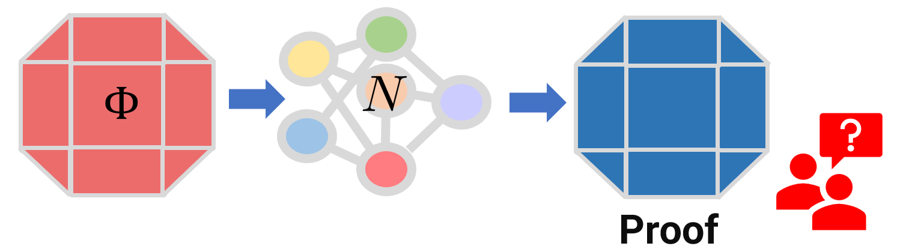
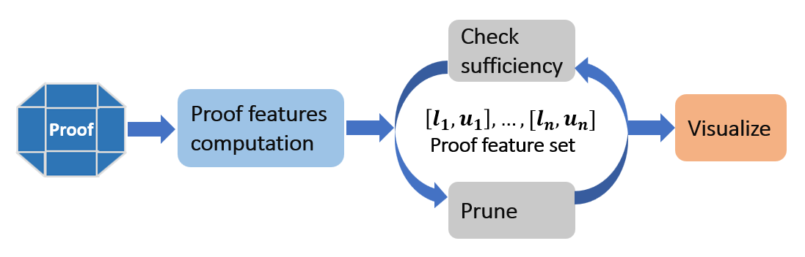
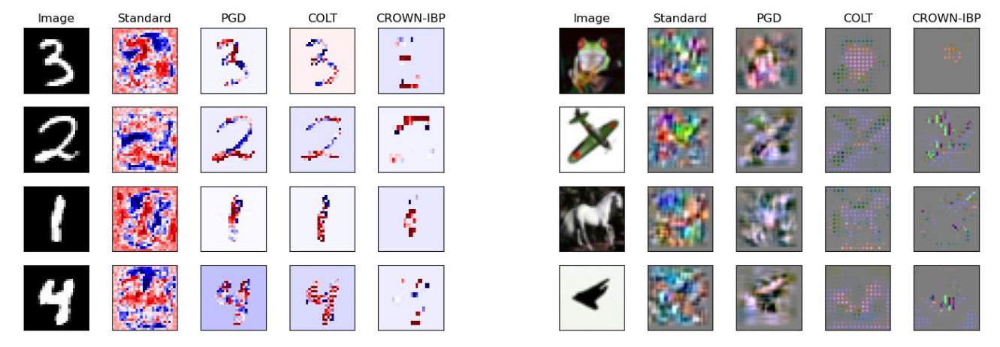

<p align="center">
  
</p>

# ProFIt: ProoF Interpretation Technique 

<p align="left">
    ℹ️&nbsp;<a href="#-about">About</a>
    | 📖&nbsp;<a href="#-more-about-profit">More About ProFIt</a>
    | 🚀&nbsp;<a href="#-quick-start">Quick Start</a>
    | 👀&nbsp;<a href="#-key-observation">Observations</a>
</p>


## ℹ️ About


**ProFIt** is a novel framework for interpreting verifier-generated proofs for Deep Neural Networks (DNNs). Unlike existing works in DNN interpretability that work for DNN prediction on individual inputs, ProFIt can interpret DNNs for local input regions potentially containing infinitely many images. Using ProFIt, we make several interesting observations regarding the impact of robust training methods on the input features the trained DNN focuses on.

## 📖 More About **ProFIt**

### How **ProFIt** works?


ProFIt involves two key steps - 1) Proof feature extraction and 2) Proof feature visualization. 
1. **Proof feature extraction** In this step, we extract neuron-level information for the proof at each layer. Given proofs are high-dimensional convex shapes (e.g. Zonotopes, convex polytopes) we project into each dimension to obtain bounding intervals or proof features. However, the number of proof features can be large making them hard to interpret individually. We propose a novel proof feature pruning algorithm that extracts - 1) small (easy to interpret), 2) sufficient (proof preserving) proof features while retaining important (higher priority) proof features.   

2. **Proof feature visualization** For each bounding interval $[l_i , u_i]$, the bounds $l_i = N_l^i(I)$ and $u_i = N_u^i(I)$ can be expressed as a differentiable function where $I$ is the input region. Then we use gradient maps corresponding to the midpoint $\frac{l_i + u_i}{2}$ for visualization.


## 🚀 Quick Start
### Python Installation and Usage Instructions
Clone this repository:
```
git clone https://github.com/uiuc-focal-lab/Profit.git
```
Install dependencies:
Conda Environment at profit.yml and can be installed with the following command.

```
conda env create -f environment.yml
```
Run proof feature extraction:
Move to the ``iclr_code`` folder and run one of the tests from ``src/tests`` folder.

```
python3 -m unittest -v src.tests.testFileName.testClassName.testName

```

Example MNIST network
```
python3 -m unittest -v src.tests.test_sparse_proofs_mnist_deepz.TestMnistSparsification_02.test_deepz_standard
```

Example CIFAR10 network
```
python3 -m unittest -v src.tests.test_sparse_proofs_cifar10_deepz.TestSparsificationCIFAR_02.test_deepz_standard
```

### Reproducing plots
For reproducing all the plots in the paper use the following command from ``iclr_code/iclr_results``. Note that you should run the proof feature extraction first (see the previous step).

```
python3 data_processing_cifar.py
python3 data_processing_mnist.py
```

### Run on custom networks

Modify the parameters (shown below) and run the following command.
```
python3 -m unittest -v src.tests.test_custom_network.TestCustom.test_custom
```
The network, verifier and the input specification can be set by the following arguments. 
```
  # Property, verifier and Network location.

  # network location (onnx format)
  net_location = config.CIFAR_CONV_SMALL 
  
  # See src/common/__init__.py for details.
  domain = Domain.DEEPZ 

  # perturbation bound that defines the input property.
  eps = 1.0/255 
```

## 👀 Key Observation


<center>

|Training Method | Proof Feature Characteristics |
| :---: | :---:|
|Standard | Can not distinguish between the foreground and background pixels. |
|CROWN-IBP | Conservative - filters out pixels even from the foreground of the image. |
|COLT | Focuses on the foreground while filtering out background pixels.
</center>

## 📜 Citation
<p>
    <a href="https://openreview.net/forum?id=Ev10F9TWML"></a>
</p>

```
@inproceedings{
banerjee2024interpreting,
title={Interpreting Robustness Proofs of Deep Neural Networks},
author={Debangshu Banerjee and Avaljot Singh and Gagandeep Singh},
booktitle={The Twelfth International Conference on Learning Representations},
year={2024},
url={https://openreview.net/forum?id=Ev10F9TWML}
}
```

## Contact
For questions, please contact [Debangshu Banerjee](mailto:db21@illinois.edu).